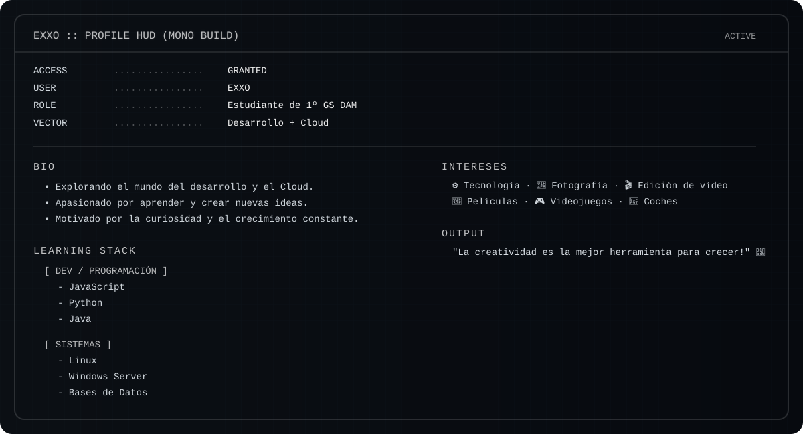

<!-- ━━━━━━━━━━━━━━━━━━━━━━━━━━━ EXXO // MONOCHROME CP2077 HUD ━━━━━━━━━━━━━━━━━━━━━━━━━━━ -->

  
  <!-- TÍTULO CHULO -->
  

  

  
  
  

   
   
  
  <!-- OPCIÓN A: Mantener tu GIF original, pero pequeño para que no choque tanto -->
  
  

  
  

   

  
  
  

   

  
  
  

  

<!-- ━━━━━━━━━━━━━━━━━━━━━━━━━━━━━━━ END OF FILE ━━━━━━━━━━━━━━━━━━━━━━━━━━━━━━━ -->
